# Outbound – Writeup (Easy)

**Machine:** Outbound  
**Difficulty:** Easy  
**Tech Used:** Nmap, Roundcube Webmail, Metasploit, MySQL, PHP serialization, Linux privilege escalation  
**Objective:** Demonstrate enumeration, exploitation of a real-world CVE, credential extraction, and privilege escalation.

---

## Overview

Outbound is an easy-level HackTheBox machine focused on exploiting a vulnerable Roundcube Webmail instance.
The challenge involves web enumeration, using a public Metasploit exploit, decrypting serialized session data,
and escalating privileges through an allowed sudo binary.

Initial webmail login credentials are provided: tyler / LhKL1o9Nm3X2

---

## Enumeration

### Nmap Scan

Only two ports were open:
20 and 80

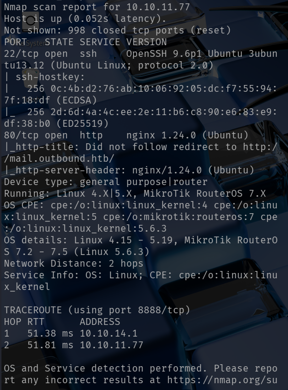


The site on port 80 redirected to 'mail.outbound.htb', so I added this to /etc/hosts.
I tried running dirsearch and ffuf against the target to find additional vhosts and directories but the search did not show anything useful.

---

### Vulnerability Discovery

I login to the webmail server using the provided credentials. The About page reveals the version:

```nginx
Roundcube Webmail 1.6.10
```

After researching, I discovered the site is vulnerable to CVE-2025-49113; a PHP object deserialization vulnerability allowing
remote code execution.

Exploit-DB provided a working metasploit module, so I used that for exploitation.

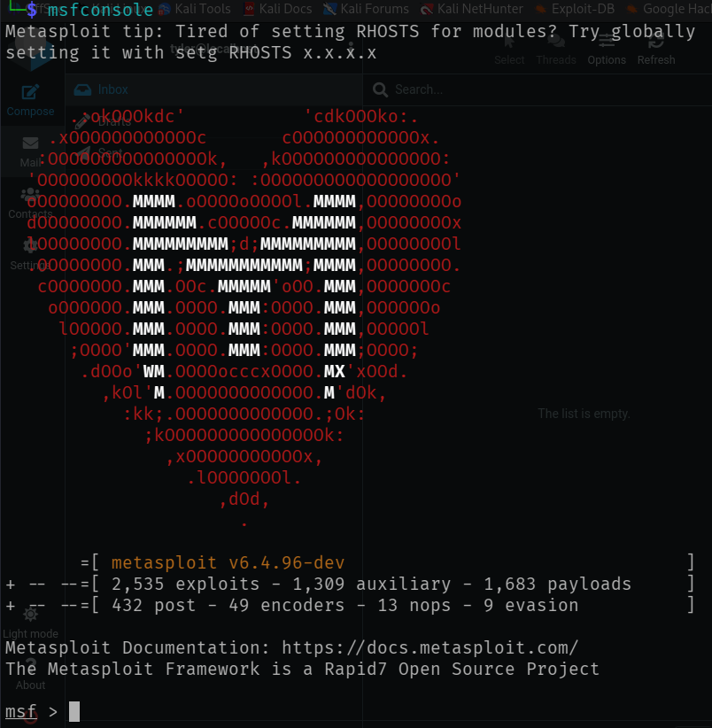

## Initial Foothold
I ran metasploit and loaded the CVE-2025-49113 module, set required options for the payload, and executed the exploit.
The exploit ran successfully and I received a shell as 'www-data'.

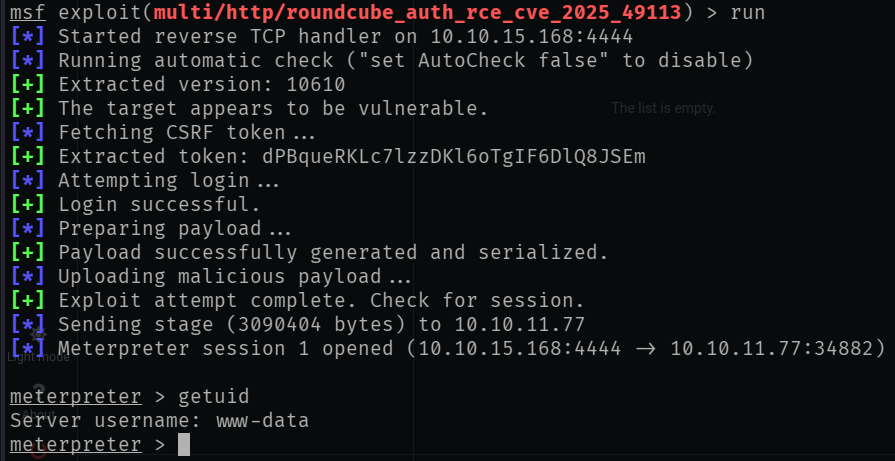

I upgraded my shell using:

```bash
script /dev/null -c bash
```
## Credential Recovery
Inside /var/www/html/roundcube/ I found:
  - Main Roundcube config
  - MySQL credentials
  - Encryption key used for session/password storage

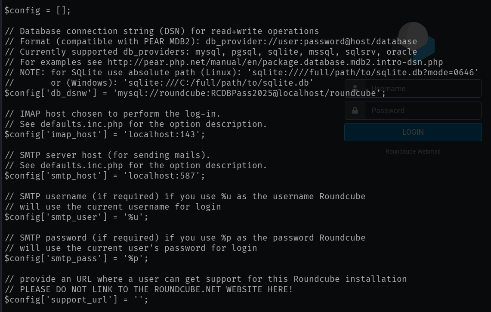
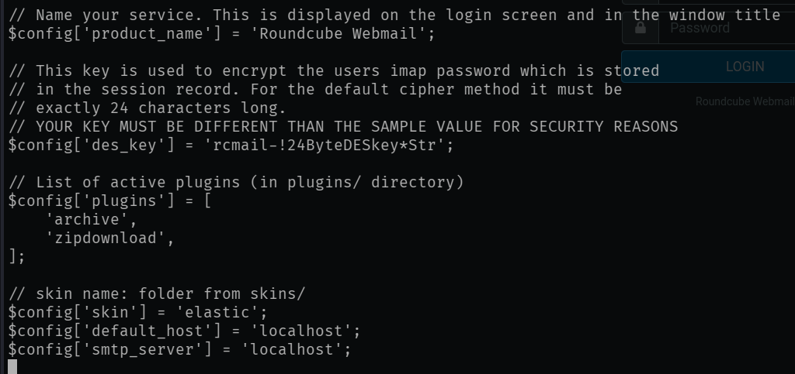

Using the MySQL login from the config file, I inspected the 'users' and 'session' tables in the database.
I was able to find serialized data objects and base64 encoded data.

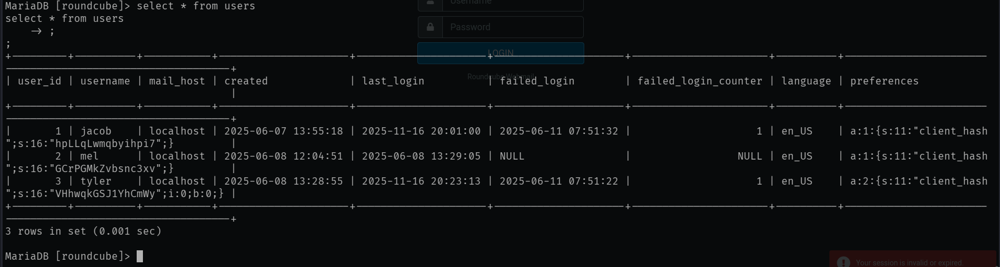

Decoding the session data revealed:
  - username: jacob
  - an encrypted password

Roundcube included a utility script (decrypt.sh) which, combined with the config key, allowed me to decrypt the stored password:

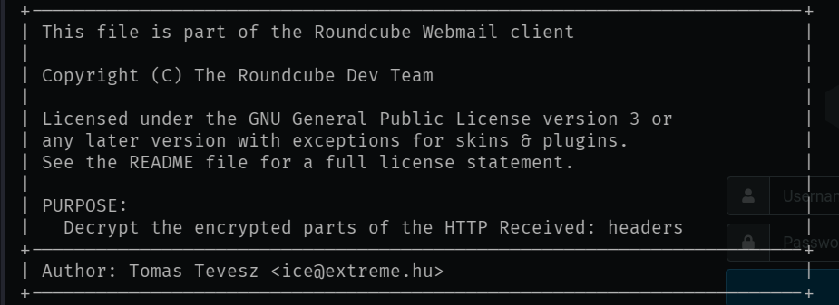

```nginx
595mO8DmwGeD
```

Using this password I logged into Jacob's webmail account. 2 emails were revealed, with one containing a SSH password:

```nginx
gY4Wr3a1evp4
```

Logged in via SSH:

```bash
ssh 10.10.11.77 -l jacob
```
Captured the user flag:

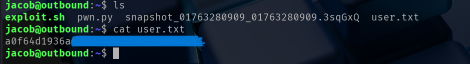

### Priviledge Escalation
Checking sudo -l, I see Jacob has sudo access to:
```bash
/usr/bin/below
```

I then read the 'exploit.sh' file in Jacob's directory. It is a script that creates a new user named 'Hades' with root privileges using below.

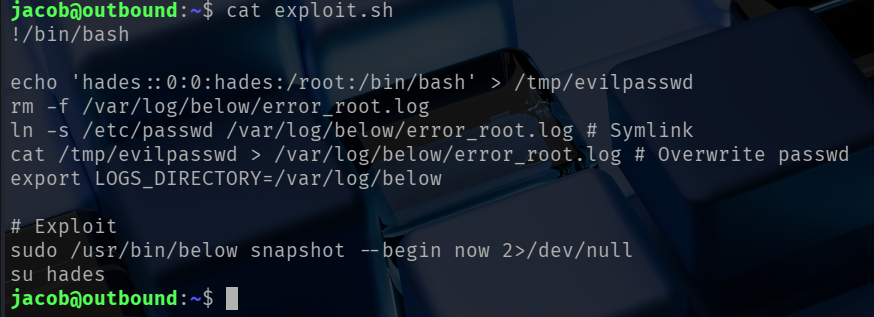

Running:

```bash
bash exploit.sh
```

Spawned a shell as 'Hades' (equivalent to root):

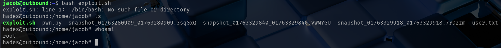

Navigated to /root to retrieve final flag.

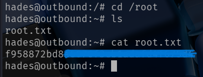

### Conclusion
Outbound demonstrates:
  - Enumeration
  - Real-world exploits
  - Decoding and decrypting PHP session data
  - Extracting credentials
  - Straight forward sudo-based privilege escalation
