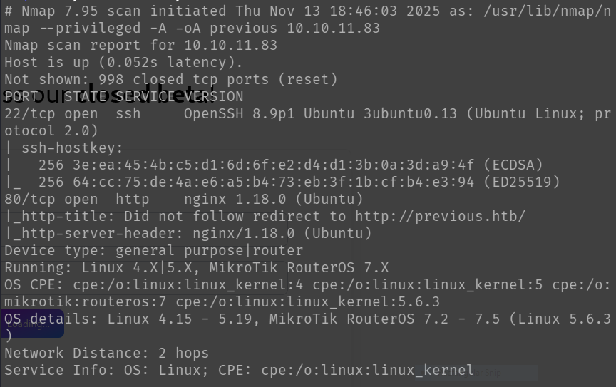
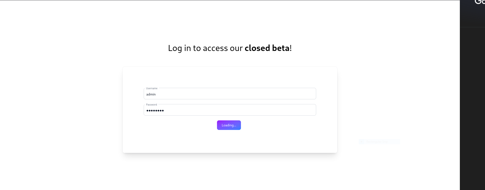
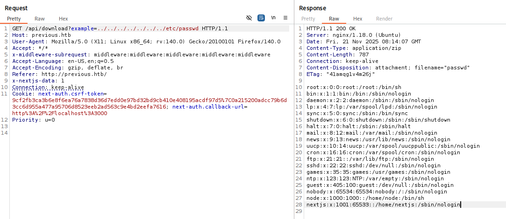
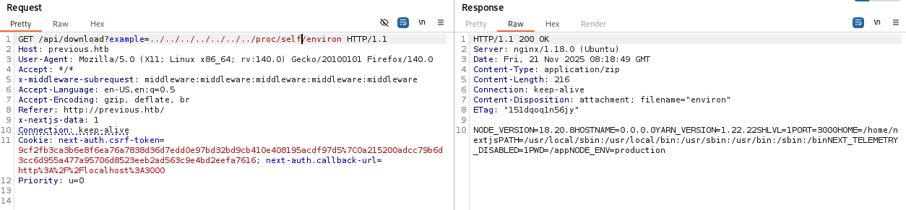
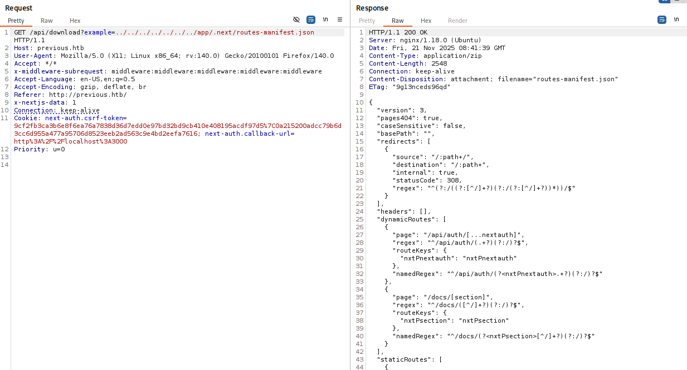
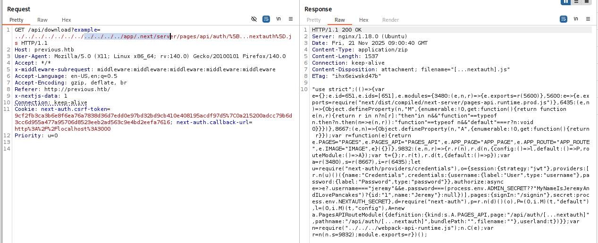

# Previous – Writeup (Medium)

**Machine:** Previous  
**Difficulty:** Medium  
**Tech Used:** Nmap, BurpSuite, Next.js, CVE-2025-29927, LFI, dirsearch/ffuf, Linux privilege escalation  
**Objective:** Identify an insecure Next.js configuration, leverage an LFI vulnerability to discover authentication logic, extract credentials, and escalate privileges through a misconfigured sudo binary.

---

## Overview

Previous is an easy-level HackTheBox machine focused on exploiting a vulnerable Next.js application.  
The machine involves enumerating an exposed API, abusing a known Next.js header-based vulnerability, leveraging Local File Inclusion to discover internal application routing, and retrieving credentials from authentication logic stored in Next.js build files.  
Privilege escalation is achieved through an allowed Terraform binary.

---

## Enumeration

### Nmap Scan:

Only two services were exposed:

- **22/tcp** – SSH  
- **80/tcp** – HTTP



Navigating to the site on port 80 displayed documentation for a closed beta platform.  
Attempting common credentials against the login prompt resulted in no access.




### Web Application Analysis:

While browsing the site, the API endpoints were visible in the URL structure.

I opened BurpSuite to inspect the traffic and began analyzing the framework.  

Accessing the provider route:
```bash
/api/auth/providers
```
returned a list of callback URLs, confirming the application used Next.js authentication modules.

### Vulnerability Discovery:

Researching Next.js security, I discovered CVE-2025-29927, a flaw where adding a specific HTTP header causes Next.js security protections to fail.  
Although authentication bypass attempts were unsuccessful, the vulnerability still allowed additional visibility into routes and responses.

I proceeded with directory fuzzing:

- `dirsearch` for initial endpoint discovery  
- `ffuf` against `/api/` specifically  

This revealed an interesting path:
```bash
api/download
```
Enumerating parameters for this endpoint uncovered an LFI vulnerability using the parameter `example`.

Using BurpSuite, I confirmed I could read arbitrary files by accessing /etc/passwd:



### Deep Enumeration via LFI:

Further LFI probing revealed:
```bash
/proc/self/environ
```
Which revealed the application startup path in /app.



After researching typical Next.js directory structures, I navigated through the application folder and located:

```bash
/app/.next
```

Inside this directory, the file 'routes-manifest.json' contained the routing configuration.



It also showed the internal authentication logic used by NextAuth, found in "/api/auth/[...nextauth]".

After reviewing the javascript, I was able to find credentials:




---

## Initial Access

Using the retrieved credentials, I logged in via SSH and retrieved the user flag:

```bash
ssh previous.htb -l jeremy
```
![]

** Privilege Escalation 

Running:
```bash
sudo -l
```

showed that jeremy could execute /usr/bin/terraform as root.

![]

Terraform, when run with elevated privileges, allows reading arbitrary files via certain modules.
Abusing this, I constructed a simple Terraform configuration pointing to a root-owned file and executed it using sudo, retrieving the contents and escalating privileges.


################### to be continued

This provided access to the root account, allowing retrieval of the final flag.

Conclusion

Previous demonstrates:

Enumerating exposed API functionality

Understanding Next.js routing and authentication mechanisms

Exploiting a parameter-based LFI vulnerability

Extracting credentials from compiled Next.js build files

Using Terraform as a privileged binary to escalate to root


